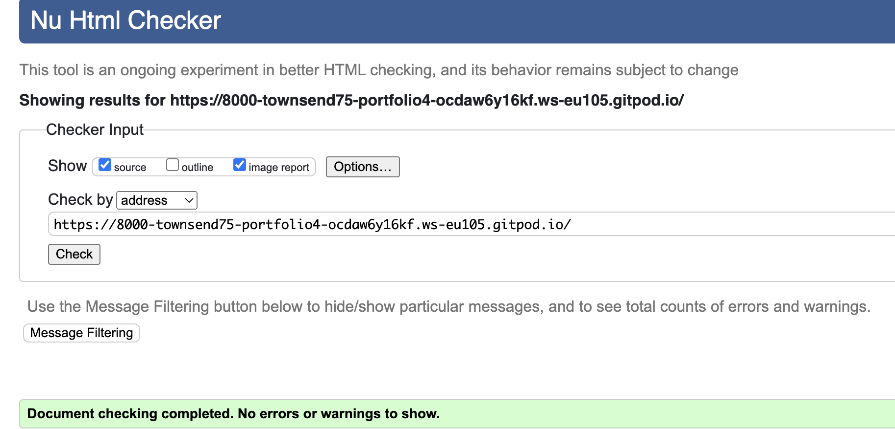
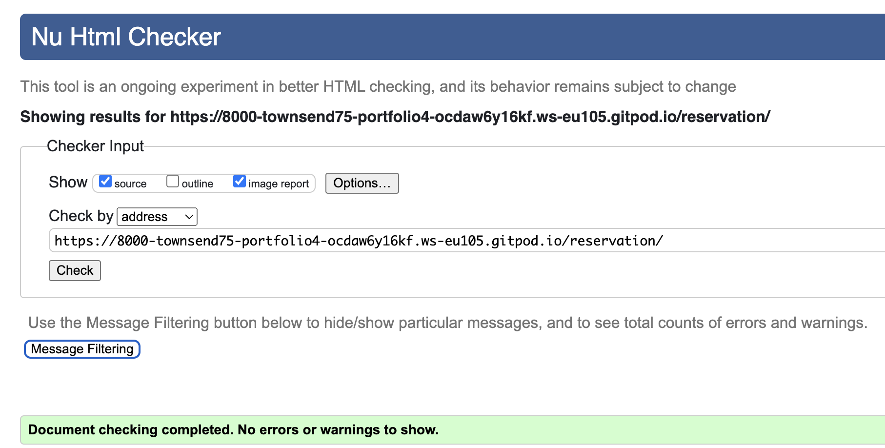
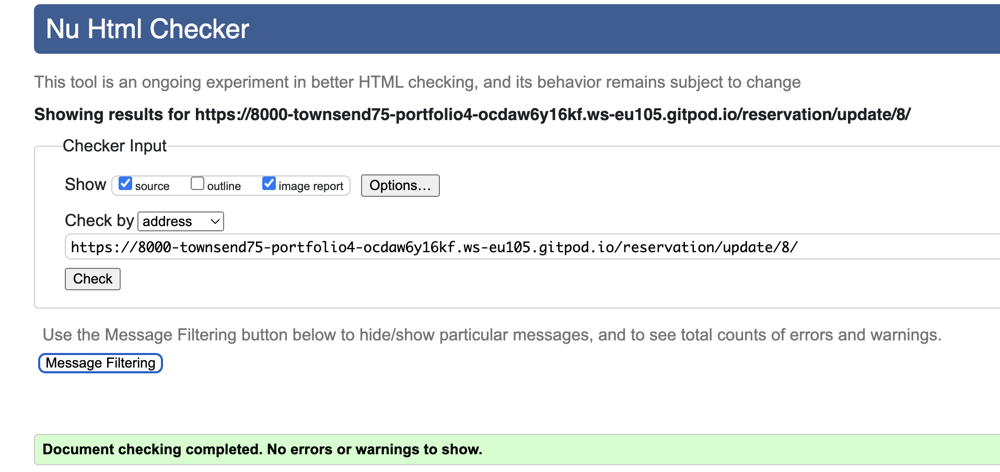
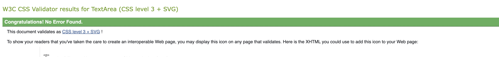
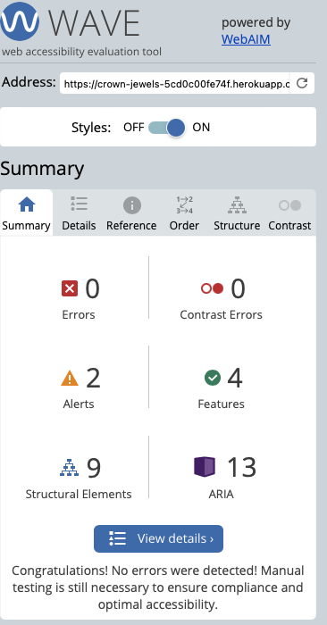
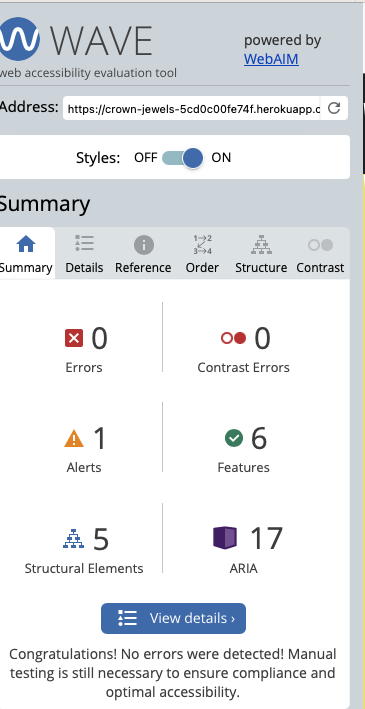
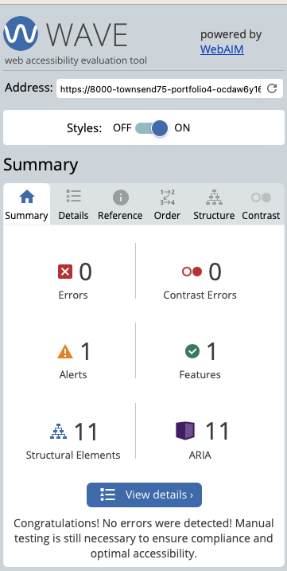
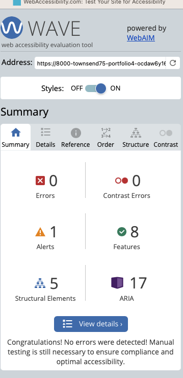

# Testing

## Notes
- I received warnings regarding potential misuse of aria-labels for the social network icons. Whilst not a specific error, I have left them out for the purpose of this project, but I am aware that they would need to be included in any official website. 

## Code Validation

## HTML

| File | Screenshot | Passed/ Notes |
| ----------- | ----------- | ----------- |
| Home | 
| reserve |
| seebookings | 
| update | 

## CSS

| style.css | 

## Accessibility testing

I tested the accesibility levels of the site using the WAVE Web Accessibility Evaluation Tool The Alerts in the images are based on the tool deciding if something should be a heading where I didn't require it. Here is a table of results for each page:

| Page | Screenshot | Notes
| --------- | ---------- | ----------|
| Home |  | no errors |
| booking|  | no errors |
| view bookings |  | no errors |
| Update |  | no errors |

## Browser compatibility

I cheacked the deployed site on Google Chrome, Safari and Mozilla with no problems to be found on any pages.

## Responsiveness

I checked the site in various different formats. It showed good responsiveness on all of the devices listed on Google Chrome Inspector. 

## User Stories (Customer)

| User Story | Site functionality |
| ------------- | ---------------|
| Register as a user | The landing page encourages the user to either register or signup. The register button is highlighted when hovered over and redirects to a registration page. A message is displayed after a successful registration|
| Login | Users who have already registered can sign in via a button in the navbar. A message is displayed after a successful login|
| Logout | Once in the area for registered users, there is always a button in the navbar redirecting users to a logout page. The user is asked to confitrm the logout before it is executed. Successful logout is confirmed by a message alert.|
| Make a booking | Once registered, the user can click on a button in the navbar to make a booking. They are then redirected to a booking form. Once the form is submitted, the user receives a message confirming the booking has been sent |
| View a booking | Registered users can view all of their current bookings in one page, accessed by clicking on the button in the navbar |
| Delete a booking |From the bookings view, the user can select any booking from the list and delete it via a button. Once deleted, the booking vanishes and a message tells the user that the booking was deleted |
| Edit booking  | From the bookings view, the user can choose to update any existing booking. All elements of the original booking are shown and all elements cna be changed. A message informs the user that the booking was successfully updated |

## User stories (Administrator)

 User Story | Site functionality |
| ------------- | ---------------|
| View bookings |In the admin panel, the admin can view all bookings which have been made so far, sorted by date.   |
| Add bookings individually  | The admin panel provides the chance to manually add bookings to the database, which may have been made by telephone or in person rather than through the booking form |
| View users    | The admin can view all registered users in one table |

## Future considerations

- I would have liked to have added a reviews page, where customers could leave comments about their experiences, which could be commented on by the manager, enabling a flow of information. 
- I would also add a maximum capacity for the restaurant, complete with table sizes and possibly a seating plan so that overbooking could be avoided.
- I would add more images to the booking pages of the site to enhance the overall visual effect. 

## Remaining bugs

Whilst all the elements of the site function correctly, there are still minor issues with the loading of images,  the speed of which I would like to improve. Also, I did not find a perfect solution for displaying the times as a set of choices. I would revisit this issue given more time. 

